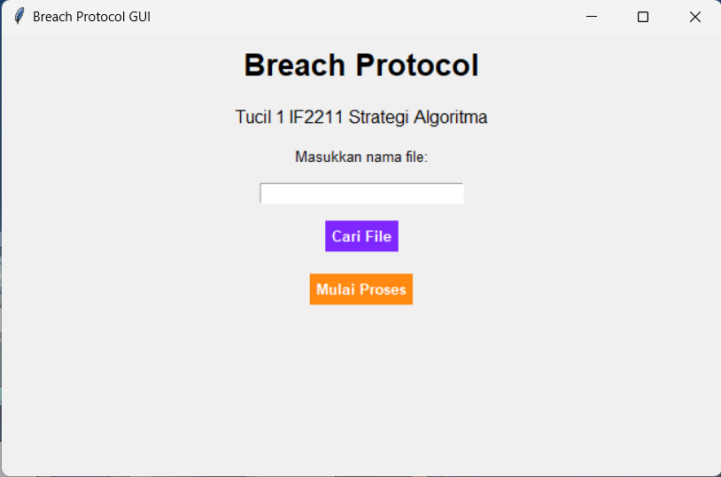

# Tucil1_13522163

Breach Protocol adalah teknik dalam dunia komputer dan keamanan informasi yang digunakan untuk mengakses atau menembus sistem atau jaringan yang dilindungi dengan memanfaatkan celah atau kerentanan dalam keamanan. Ini dapat dilakukan dengan berbagai cara, termasuk memanfaatkan kelemahan perangkat lunak, teknik phishing, atau serangan brute force. Tujuan utama dari breach protocol adalah untuk mendapatkan akses tidak sah ke data sensitif atau sistem yang dilindungi untuk tujuan yang tidak sah, seperti pencurian informasi atau merusak sistem.

<br/>

## Dependencies
#### Program Utama & User Interface
```bash
  1. pip install colorama
```
```bash
  2. pip install pyfiglet
```
```bash
  3. pip install tk
```

#### Atau install semuanya dalam satu command
```bash
  pip install requirements
```

<br/>

## Cara Menjalankan Program
```bash
  git clone https://github.com/AtqiyaHaydar/Tucil1_13522163.git
```
```bash
  cd (path menuju hasil clone)
```

#### Untuk Menjalankan Program Menggunakan CLI
```bash
  python3 src/BreachProtocol.py
```
#### Untuk Menjalankan Program Dengan GUI 
```bash
  python3 src/BreachProtocolGUI.py
```

## GUI


<br/>

## Identitas Pembuat Program

- Nama : Atqiya Haydar Luqman
- NIM : 13522163
- Kelas : K3
